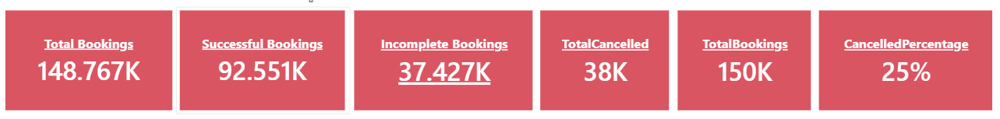

# 🚖 Taxi Fare Dashboard | Power BI

An interactive **Power BI dashboard** built to analyze taxi trip data and uncover insights into fare patterns, trip characteristics, passenger behavior, and revenue trends. This project demonstrates end-to-end data analysis, from data transformation to interactive business intelligence reporting.

---

## 📌 Project Overview

The Taxi Fare Dashboard provides a comprehensive analysis of taxi trips by visualizing key performance indicators (KPIs), fare distribution, trip trends, and geographic insights. It helps identify revenue-driving factors and enables data-driven decision-making for taxi service operations.

---

## 🎯 Objectives

- Analyze taxi fare and trip data.
- Monitor key business metrics through interactive dashboards.
- Identify trends in trip volume and revenue.
- Compare fare performance across different payment types and passenger counts.
- Visualize pickup and drop-off locations using maps.
- Provide actionable insights for operational improvement.

---

## 📊 Dashboard Features

- **Executive KPI Cards**
  - Total Trips
  - Total Revenue
  - Average Fare
  - Average Trip Distance
  - Average Trip Duration

- **Revenue Analysis**
  - Revenue by Month
  - Revenue Trends

- **Trip Analysis**
  - Trips by Passenger Count
  - Trips by Payment Type
  - Trips by Vendor

- **Geographical Analysis**
  - Pickup Locations
  - Drop-off Locations
  - Interactive Map Visualization

- **Fare Analysis**
  - Fare Distribution
  - Average Fare by Passenger Count
  - Fare by Payment Type

- **Interactive Filters (Slicers)**
  - Date
  - Passenger Count
  - Payment Type
  - Vendor
  - Rate Code

---

## 🛠️ Tools & Technologies

- **Power BI**
- **Power Query**
- **DAX**
- **Data Modeling**
- **CSV Dataset**
- **Microsoft Excel**

---

## 📂 Project Structure

```
Taxi-Fare-Dashboard
│
├── Dashboard
│   └── Taxi_Fare_Dashboard.pbix
│
├── Data
│   └── taxi_data.csv
│
├── Images
│   ├── dashboard.png
│   ├── KPI.png
│   └── Map.png
│
├── README.md
└── LICENSE
```

---

## 📸 Dashboard Preview

### Dashboard


### KPI Overview



### Geographic Analysis


---

## 📈 Key Performance Indicators

- 🚕 Total Trips
- 💰 Total Revenue
- 💵 Average Fare
- 📍 Average Trip Distance
- ⏱️ Average Trip Duration

---

## 💡 Business Insights

The dashboard enables users to:

- Identify peak revenue periods.
- Compare fare trends over time.
- Analyze customer travel behavior.
- Evaluate the impact of passenger count on fares.
- Compare different payment methods.
- Discover high-demand pickup and drop-off locations.
- Monitor operational performance through interactive KPIs.

---

## 📚 Skills Demonstrated

- Data Cleaning
- Data Transformation (Power Query)
- Data Modeling
- DAX Calculations
- KPI Design
- Dashboard Design
- Interactive Visualizations
- Business Intelligence
- Geographic Analysis
- Analytical Thinking

---

## 🚀 Future Improvements

- Real-time data integration
- Weather impact analysis
- Driver performance dashboard
- Demand forecasting using machine learning
- Fare prediction model
- SQL database integration
- Advanced DAX measures

---

## 👨‍💻 Author

**Akhand Pratap Singh**

Aspiring Data Analyst with expertise in **Power BI, PostgreSQL, Excel, DAX, Power Query, Data Visualization, and Business Intelligence**.

---

## ⭐ Support

If you found this project helpful or interesting, consider giving the repository a **Star ⭐**.
